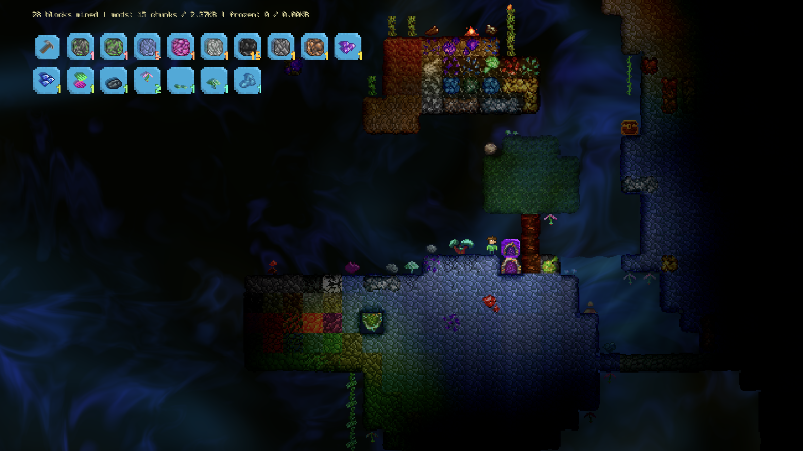
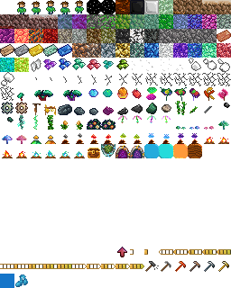

# Depthwell

Depthwell is a procedural fractal mining incremental. How deep can you explore? Minimal demo release planned to be late 2026/early 2027.

> [!WARNING]
> This game is pre-demo so all saves may break at any time due to core logic changes!
> The current `README` is **incomplete**, as this game is still in the pre-demo stage; more details will be added in the future and details might currently be out of date. Read the code to see specific implementations and TODOs.

### Images





### How to play

Stuck with how to begin?

- Left-clicking places blocks; click on inventory slots directly to select block types and indicators above certain block types to open menus.
- Select the pickaxe in the inventory to mine and WASD/arrow keys to move around.
- Start by trying to find items with indicators above them: you can smelt ores into bars at a furnace, and upgrade your pickaxe at "cores" with a gray hovering orb...these act like crafting stations!
    - These are different from campfires, which simply emit light in a certain area.
- You can't mine everything! That means that either your pickaxe isn't good enough or that item can't be mined yet.

Use the M key to open or close the debug menu options (and logs); use creative mode from within the menu to test blocks easily.

For inventory hotkeys:

- Use backquote and 0-9 keys to change inventory selection.
- Q moves up a row in the inventory while E moves down a row.

### Building

To build `node_modules` and begin, run `npm install`.

Run:

- `zig build` to build Zig code (automatically detects `main.aseprite` changes)
- `zig build -Dgen-enums` to build _and_ generate `enums.ts` if changes were made.
- `zig test "zig/root.zig"` to run (all) tests

See `build.zig` for more options on compiling a final version! It's enormously helpful to use the Zig Language Server in VSCode/VSCodium and set it to "watch" mode, which automatically builds the WASM while providing highlighting any errors as well as "Go to Definition" quality-of-life.

Useful variables to customize include `CONFIG` in `src/main.ts`, `engine.wireframeBrightness`, `engine.baseSpeed`, and `zig/state/player.zig` config options.

When building for production with Vite (using `npm run build` instead of `npm run dev`), use `zig build -Dgen-enums -Dwasm-opt` (with WASM optimizations from Binaryen).
Alternatively, use and modify `.githooks/pre-commit`.

#### About version control

NOTE: you can change whether diffs are visually shown through `.vscode/settings.json`.

Run `jj git init` and `jj bookmark track main --remote=origin` after cloning if you plan to use Jujitsu.

Git VCS is supported by default; to use Jujitsu building for release, simply run `./build.sh` (after running `chmod +x ./build.sh`). You can also easily build/push for Windows by converting the commands to their Windows equivalents very easily.

To commit to the main branch, you can use `./push.sh` (after running `chmod +x ./push.sh`) or create an alias in your config.

#### Git building tips

To auto-build Vite before commit:

```sh
git config core.hooksPath .githooks
chmod +x .githooks/pre-commit
```

### Architecture details

Game is created using Zig and WebGPU, and meant to be web-first. A final product that uses Mach Engine for native building is planned, but _web will always be free and receive updates_. The internal viewport is 480x270 (but it automatically scales with the DPI/base resolution). Functions are exported from `zig/root.zig`.

By using `ChaCha12` and `Blake3` and a seed with 1-100 `a-z` characters, the game can generate over `10^140` possible maps, with depth and chunk sizes only practically bound by storage/RAM limits! Performance-sensitive areas are generated using `FastHash`, which uses 128-bit seed vectors at a time.

#### How chunks come to life

Before the specifics, here's the fixed pipeline a chunk runs through. Every stage is a deterministic function of the seed and the chunk's position, so the same chunk regenerates identically whether it is streamed in for the first time, revisited from cache, or rebuilt on load. Later stages only ever _read_ what earlier ones produced (think of this as a "dependency order"), never the reverse, which is what keeps the whole thing order-independent across chunk borders:

1. **Base terrain** sets up the world! Each cell samples moisture and density noise to pick its foundation block (a stone variation, lava stone, air for caves, water in pools). This is the "raw" world with no features yet.
2. **Ores and gems** get added to the terrain. A second noise pass overlays ore "veins" onto these terrain blocks. Ores/gems record the stone visually beneath them as `base_id`.
3. **Structures** that are terrain-gated features (chambers, pillars, geodes, trees) are placed by a prioritized, collision-resolved planner. This uses hashing, attempts to minimize biases, and decides _whether and where_ a structure exists at all.
4. **Decorations** appear after, which are context-aware plants (mushrooms, flowers, vines, shrubs) that only check local terrain (whether there's a solid block above and below, for example).
5. **Modifications** then get applied, which are any player edits (or water flowing changes) recorded in the `ModificationStore`. These are "replayed" over the freshly generated chunk, overriding whatever generation produced. This is the only stage that isn't purely procedural, and it, of course, has the highest priority.
6. **Derived passes** finish up, with edge flags and waterlogging getting (re-)computed again after modifications, from the settled block ids/neighbors. Then a lighting value pass occurs right before sending data to WGSL. These are render/simulation state so they're re-calculated rather than stored.

Note that when the player tries to modify part of the world, min(e?)ability is checked based on the tool, and adjacent blocks are removed according to a set of rules (edge flag logic or multi-block data).

#### Coordinates and basics

Here are the basic terms (note that there are, for example, 16 possible subpixels for both the X/Y coordinates for a pixel, so these are for one dimension):

- 1 Pixel = 16 Subpixels
- 1 Block = 16 Pixels
- 1 Chunk = 16 Blocks = 256 Pixels = 4,096 Subpixels
- **Depth**: How "deep" the player is. Depth starts at $6$ (see `STARTING_ZOOM_TIMES` in `zig/startup.zig`). Each time you enter a portal, the world zooms in by $4\text{x}$, making terrain look 4 times larger, and the depth increases by 1. You can think of this as "delving deeper" in to the world or descending farther. Ascending would be decreasing the depth.
- **$D$**: Shorthand for the current depth. You can think of depth $D-1$ as the coordinate space you occupied right _before_ entering a portal.
- **The Event Horizon ($H$)**: Shorthand for $D-32$. When you are deep in the fractal ($D \ge 32 + 6$), the game stops tracking individual blocks shallower than 32 levels above you. This is because at $H$, each block is $2^{64}$ times wider than than the current depth, and recursive logic can stop. (This is internal and, when functional, shouldn't be noticeable or affect gameplay. More explanations below.)

The player starts off at `STARTING_ZOOM_TIMES`, which defaults to 6. So, $D$ starts off as 6 and $D-1$ doesn't exist until $D$ increases further.

The camera and the player work with (integeric) subpixels, while entities are considered in terms of (floating-point) pixels. Seeding of specific blocks in chunks and modifications concern themselves with blocks. Asking something "where" it is involves just chunks (see later).

Now, bear with me here, because you might be freaking out over the fact a code segment just appeared. But don't fret, I'll break things down! This code is just those interested in specific details on what these numbers _could_ mean, because there are a lot of definitions!

Basically, all the code below is doing is declaring some constants in Zig, a fancy low-level language. The `CHUNK_SIZE` variable just represents 16; you don't really need to understand the code blocks so feel free to skip these. From `zig/memory.zig`:

```zig
/// The main number (as an integer) representing the number of blocks in a chunk, number of pixels in a block, and number of subpixels in a pixel. (Note that changing these values WILL break the code!)
pub const CHUNK_SIZE: comptime_int = 16;
// ...
/// An integer representing the number of subpixels in a block, pixels in a chunk, number of blocks in a chunk, number of pixels in a block, and number of possible subpixel positions within a pixel.
pub const CHUNK_SIZE_SQ: comptime_int = CHUNK_SIZE * CHUNK_SIZE;
// ...
/// An integer representing the number of subpixels within a chunk. The player's X and Y coordinate should wrap around such that it is between 0 and this value (inclusive).
pub const SUBPIXELS_IN_CHUNK: comptime_int = CHUNK_SIZE * CHUNK_SIZE * CHUNK_SIZE;
```

Imagine the entire game world as a massive grid. Every time you zoom in, every single grid cell splits into a $2\text{x}2$ layout of $4$ smaller sub-cells.

Your position in the world is essentially a string of directions: _"From the top level, go to cell 2, then go to sub-cell 3, then sub-cell 1..."_ Because every step is a choice between 0, 1, 2, or 3, each step can be represented as a tiny **2-bit number** (a `u2`).

To represent where any chunk is, we use a struct called `Coordinate` composed of three parts:

- The **active suffix (`Coordinate.suffix`)** is an array of two 64-bit unsigned integers (`u64` vectors) representing the X and Y paths of your zoom steps. Because each step is 2 bits, we can pack exactly 32 steps ($32 \times 2 = 64$ bits) into this single number. This is incredibly fast and memory-efficient!
- The `QuadCache` or **prefix stack** is used because if you zoom deeper than 32 levels, we run out of bits in our 64-bit active suffix. The oldest steps at the top of the path "fall off" (overflow) and are pushed to a global prefix stack (`left_path` and `top_path`).
- Finally, a **quadrant ID (`Coordinate.quadrant`)**: stores 2-bit number (0 to 3) identifying which of the 4 parent quadrants of the active zoom path the chunk belongs to.

> [!NOTE]
> Important detail! If your `depth` is at or below 32, the quadrant ID defaults to 0 and the game relies entirely on the 64-bit active suffix.

The reason all this quadrant logic works is because of one essential fact: **_The `depth` can only INCREASE!_** The player can't zoom out **and modify blocks**, which is the main reason this quad-cache rebasing assumption is safe. If this were the case, it would introduce a host of complexities and "exploits" that easily allow block duping.

#### Depths

To make sure we can zoom 10,000 layers deep without significant lag or RAM issues, we pack the historical rebase steps very tightly using a custom bit-packing algorithm.

Suppose you are at $D=6$ (so your path has 6 steps), and your horizontal path is
`[2, 3, 1, 0, 3, 2]`.

Because the zoom factor is $4$, each step acts as a digit in a **base-4** number. Your absolute coordinate on this axis would be calculated as:

$$X = 2 \times 4^5 + 3 \times 4^4 + 1 \times 4^3 + 0 \times 4^2 + 3 \times 4^1 + 2 \times 4^0 = 2958$$

In binary, this is represented as a sequence of 2-bit pairs: `10 11 01 00 11 10`. This fits perfectly inside the 64-bit active suffix!

#### What if $D>32$?

When you zoom past 32 levels, the 64-bit suffix overflows. The oldest 2-bit steps fall off and are converted into 3-bit top-left origin offsets (`left_cell_x` and `top_cell_y`) ranging from `0` to `6`.

To minimize space use, the global prefix stacks (`left_path` and `top_path`) pack these 3-bit steps into 64-bit slots:

- Since $\lfloor 64 / 3 \rfloor = 21$, we pack exactly **21 historical steps** into a single `u64` integer.
- The game uses dynamic division and modulo math (`idx / 21` and `(idx % 21) * 3`) to find and extract these values on the fly.

#### Storing modifications

Of course, to have a fractal _mining_ game, you must store if the player has modified any chunks. This boils down to asking one crucial question for each chunk:

> Does this chunk have any blocks where the player replaced a block of type A with type B?

(Air/empty space is itself a type of block.) If the answer is YES, that chunk gets an entry in the `ModificationStore` (keyed by a `DepthCoordinate` referencing both location and height). The entry is _sparse_, as it records only the individual cells that differ, so a single edited block in a 256-block chunk costs one cell, not a whole chunk. See "The fractal modification buffer" below for the layout.

But wait, what is a block? Here is `zig/memory.zig`:

```zig
/// Contains a `Sprite` id and various packed properties; ready to be sent to the GPU or stored in caches.
/// Field order keeps every field inside one aligned 32-bit word so the shader (`unpack_tile()` in src/shader.wgsl) extracts each with a single per-word `extractBits()`:
/// - word0: `id` | `edge_flags` | `light`
/// - word1: `hp` | `seed` (the shader reads the whole word as seed0, so `hp` is folded into the seed for free)
/// - word2: `base_id` | `id_edge_flags` | `lighting_color`
/// - word3: `waterlogged` | `_pad`
pub const Block = packed struct(u128) {
    /// A block with an `id` of `none`.
    pub const empty: Block = .makeBasicBlock(.none, 0);

    /// Maximum value for `hp`. `hp` is a `u4` (sharing word1's low bits with `seed`) and MUST stay 0-15:
    /// the atlas has exactly 16 HP masks and the water volume simulation assumes 0-15.
    pub const MAX_HP: u4 = 15;

    /// The primary sprite: the overlay/block itself (such as the ore rather than the block beneath).
    id: Sprite,
    /// Edge flags: explains details for neighbors (for both shader and procedural generation).
    /// Starts from top left, then middle left, and ending at bottom right (skipping itself).
    /// See types/types.zig for more details on correspondence.
    ///
    /// - A 1 bit for a solid block ordinarily indicates an edge with an adjacent solid block.
    /// - A 1 bit for a liquid block means that there is either solid or liquid adjacent.
    /// Edge flags must be reset to 255 for decorations (non-blocks or liquids) after a final decoration pass.
    edge_flags: u8,
    /// The brightness of the tile.
    light: u8,

    /// Dual-purpose field depending on block type (range 0-15, see `MAX_HP`):
    /// - For solid blocks: how "mined" the block is (0 means unmined, 15 is most mined).
    /// - For liquid (water) and decoration blocks: the water volume level from 0 to 15.
    hp: u4,
    /// Per-block seed for procedural variation in the shader.
    /// Any seed value here should be considered poor and insecure.
    seed: u28,

    /// The underlying background tile behind an overlay sprite (e.g. the stone an ore/gem grew inside).
    /// `.none` means "no underlay"; the shader then renders `id` alone (the common case for non-ore/gem blocks).
    base_id: Sprite = .none,
    /// Same-sprite edge flags (same bit order as `edge_flags`): a bit is set when the neighbor's `id` equals this block's `id`.
    /// Drives the ore overlay mask so a vein reads as connected only to itself.
    /// Follows the same 0xFF reset rule as `edge_flags` for decorations/air.
    id_edge_flags: u8 = 0,
    /// Type of color lighting should use.
    /// - 0: default white
    /// - 1: warm orange glow
    lighting_color: u8 = 0,

    /// Packed directional waterlogging field (bits 0-10 used; see `WaterloggedState` in zig/state/water.zig).
    /// - For liquid blocks: only bit 0 is read (liquid directly above).
    /// - For non-liquid blocks: encodes the surrounding water for the shader's surface fill and interpolation.
    ///   - bit 0: top (water of any depth directly above; fully submerges/fills the block)
    ///   - bit 1: bottom (full liquid block directly below at HP=15)
    ///   - bit 2: top ripple cutoff (adjacent water surface is exposed to air)
    ///   - bits 3-6: left adjacent liquid volume (0-15; 0 means no liquid to the left)
    ///   - bits 7-10: right adjacent liquid volume (0-15; 0 means no liquid to the right)
    waterlogged: u12 = 0,
    /// Unused portion of block data.
    _pad: u20 = 0,
    ...
}
```

Well, now you know what a block contains. The `edge_flags`/`id_edge_flags` neighbor masks power a higher-level abstraction worth its own explanation; see "Edge flags" below.

The most complex part of Depthwell's architecture, though, is ensuring that a hole mined at Depth 0 results in an empty 4-by-4 region at Depth 1, 16-by-16 at Depth 2, and so on. This is handled through a neat little **lineage check** during chunk generation.

When the generator builds a chunk at Depth $D$, it iteratively traverses backward through the prefix stack from $D-1$ down to $D-32$. (Recall that $D$ is larger the "more zoomed in" the game is, and starts at `STARTING_ZOOM_TIMES`. It represents how many `u2`s need to represent where a chunk is, to put it another way.)

For each ancestor level, it traces upward and queries `ModificationStore` or evaluates `AncestorCache`: _"Was the parent block at this specific path modified?"_ At $D-32$ (the event horizon limit), chunk-level details are replaced by checking the global `QuadCache` 4x4 material grid. Any properties inherited directly from parents influence chunk structures appropriately.

#### Prefix stack and memoization

You might be wondering how the engine handles a path 10,000 layers deep without lag, and the solution is to **relentlessly use the prefix stack and cache the seed**. In `zig/state/world.zig`, the big prefix path is stored using dynamic array allocations (`SegmentedList`).

Why memoize and make the logic so complicated? By storing the resulting 512-bit `seed` at every level of the stack, the game no longer needs to spend resources reseeding a bunch for each chunk (while the math working out, as if every chunk was, resulting in high-quality seeding!). We never re-calculate the entire 10,000-level BLAKE3 chain; we only hash the _newest_ nibble added to the stack. This makes procedural chunk generation on ascend effectively constant-time!

#### Procedural generation

Generating a world that is statistically infinite yet perfectly consistent across billions of chunks requires a multi-pass approach. While the math might look like a bunch of magic numbers, it’s actually a carefully layered sequence of domain warping and noise functions.

#### Hashing function

In the earlier sections, I mentioned `ChaCha12` for its cryptographic strength. However, calling a full ChaCha block 256 times for every single chunk is (who knew) incredibly slow. For the heavy lifting of 2D noise, Depthwell uses a custom **stateless multiply-unrolled-multiply mixer** called `FastHash` that uses some magic numbers from Wyhash.

By using `Vec2f` vectors and bit-folding, `FastHash.hash2d()` provides enough variance for smooth terrain while being significantly faster than a standard PRNG.

#### Terrain, biomes, and ores/gems

The first pass of the terrain logic evaluates procedural values for each block coordinate to determine the "flavor" and block type of the chunk. Generation evaluates up to six noise values, with larger cell sizes meaning the noise "fluctuates" less rapidly:

- **Density** that controls primary cave structures and wall cutouts (medium cell size).
- **Cutoff** that multiplies density to dynamically expand or contract cave openings. Also used in place of secondary density occasionally (small cell size).
- **Moisture** that acts as a large-scale macro-biome selector across chunks (largest cell size).
- **Weirdness** that controls rarer, exotic stone biomes (such as lava or molten stone).
- **Secondary density** that varies specific stone types.
- **Ore density** that controls the distribution of ores and gems across host stone blocks.

These are mostly arbitrary property names, but based on the moisture and density values, a specific block type can be chosen such as normal, blue, or lava stone. Some noise values use FBM+tuned Worley noise, others use FBM+Perlin, others use Billow noise...but the point of all these varying cell sizes and algorithms is to produce varied but visually correlated output.

Ore and gem dispersal across the base stone blocks is driven by a data-driven rule palette (`ORE_DISPERSALS`, but don't let the name fool you, since this deals with both gems and ores) evaluated mostly at compile-time. Instead of executing dynamic rule evaluation at runtime, the compiler bakes noise parameters and rule constraints directly into generated WASM instructions.

Specific values and comptime logic for everything may be found in `zig/state/procedural.zig`.

#### Decoration pass

The final pass handles the "flavor" of the world. These are things such as mushrooms, spiral plants, and ceiling flowers. Since this pass is less computationally expensive, we switch back to `ChaCha12` for high-quality entropy.

Decorations are context-aware. Mushrooms only spawn if the block below is solid, ceiling flowers if the block above is solid, and spiral plants can grow multiple blocks tall by checking for a spiral plant above on top of a solid-block above generation check, and so on.

Critically, the generator finishes by setting the `edge_flags` of these decorations to `0xFF`. This tells the WebGPU shader that it shouldn't have erosion and edge darkening applied to it!

Decorations come in two shapes, both in `zig/state/decorations.zig`:

- A **point** decoration (`points`) has a fixed `size_x`-by-`size_y` footprint growing right and down from its anchor, gated by a list of terrain `constraints` (the same comptime-sorted, cheapest-first vocabulary structures use). The list is walked in _priority order_, so a taller kind claims its own base before a shorter one can steal the cell. A multi-cell kind must own its _whole_ footprint or it would render as a fragment (a `moss_shrub1` with no `moss_shrub1_right`), so if a higher-priority decoration claims any cell it overlaps, the lower one declines to place at all through `beatenByHigher()`, the decoration analogue of `structures.isBeaten()`. Same-kind "rivals" within a footprint are settled by an up-and-to-the-left tie-break.
- A **column** feature (`columns`, such as spiral plants) is a variable-length chain that anchors on a surface and grows cell-by-cell in one direction until it misses a roll or hits `max_length`. Its entering state is seeded across the chunk border by `computeColumnSeeds()` so a chain stays seamless.

Some decorations are multi-block _stacks_ pinned together through the same neighbor-support rules the rest of the world uses (`SpriteProps.requires` / `AnchorKind`, resolved into a flat list by `Sprite.supports()`; see "Storing modifications"). The vertical plant, for instance, is a `cornflower` cap over a `plant_base` shaft standing on the floor: `cornflower` requires a `plant_base` directly below it, and `plant_base` requires solid ground _or_ another `plant_base` below it (a self-stacking shaft). When the modification cascade finds a block whose required neighbors are gone, it breaks, so mining the base of a plant topples the whole thing as a unit, exactly as breaking one half of a shrub drops the pair.

#### Entities

Entities represent a generic type of sprite, with color shifts, rotation, and size changes. Here is their definition:

```zig
/// Entity data (before being sent to WGSL, using internal viewport).
/// Allows for size, rotation, and OKLCH + alpha (opacity) changes to any chosen sprite.
pub const Entity = struct {
    /// The light, chroma, hue, and opacity components (HSL + alpha).
    /// L (lightness) and alpha components are multiplied by the sprite's color in WebGPU.
    /// H (hue, in radians) and C (chroma) are shifted additively.
    lcha: Vec4f32 = DEFAULT_ENTITY_LCHA,

    /// Current center position of the sprite (based on internal viewport).
    position: Vec2f32,

    /// The size of the entity (based on internal viewport).
    size: f32 = 16.0,

    /// The rotation of the entity (radians).
    rotation: f32 = 0.0,

    /// The sprite type of the entity to use.
    sprite: Sprite = .none,
};

/// Tightly packed data for a entity to be sent directly to WGSL (using UV coordinates).
/// Allows for size, rotation, and OKLCH + alpha (opacity) changes to any chosen sprite.
pub const WGSLEntity = extern struct {
    /// The light, chroma, hue, and opacity components (HSL + alpha).
    /// L (lightness) and alpha components are multiplied by the sprite's color in WebGPU.
    /// H (hue) and C (chroma) are shifted additively in radians.
    lcha: Vec4f32 align(16),

    /// Current center position of the sprite (based on UV, not the internal viewport).
    position: Vec2f32,

    /// The width and height of the entity (based on UV, not the internal viewport).
    size: Vec2f32,

    /// The rotation of the entity (radians).
    rotation: f32,

    /// The ID of the entity (sprite type).
    id: u32,
};
```

These are then passed to WGSL in a large batch. Here is an example of potential usage:

```zig
// basic entity example:
for (0..10) |i| {
    addEntity(.{ // draw shadow of inventory slot by darkening and reducing opacity
        .sprite = if (i == selected_id) .inventory_selected else .inventory,
        .position = getInventoryPos(i) - Vec2f{ 2, 2 },
        .lcha = .{ if (i == 0) 0.8 else 0.7, 0.0, 0.0, 0.9 },
    });
}

for (0..10) |i| {
    addEntity(.{ // draw inventory slot
        .sprite = if (i == selected_id) .inventory_selected else .inventory,
        .position = getInventoryPos(i),
    });
}

// number-drawing example:
// draw selected HP (for testing)
const progress = dw.mining.selected_hp;
const pos: Vec2f = .{ 10, 28 };
const font_size = 10.0;

if (progress != 255 and progress != 0) {
    const value_hue = 0.2 + @as(f32, @floatFromInt(progress)) * (std.math.pi / 8.0);
    // draw shadow of text
    drawNumber(progress, pos - Vec2f{ 1.5, 1.5 }, .{
        .lcha = .{
            0.5, // darken
            0.4,
            value_hue, // hue changing as progress increases!
            0.8,
        },
        .font_size = font_size,
        .ltr = false,
    });

    // draw the actual number now
    drawNumber(progress, pos, .{
        .lcha = .{
            0.75,
            0.4,
            value_hue, // hue changing too
            1.0,
        },
        .font_size = font_size,
        .ltr = false,
    });
}
```

You can see how because the entities are _ordered_, it's easy to add a shadow. Additionally, the usage of white text or masks works perfectly with OKLCH (which stands for lightness, chroma, and hue). This means that not only can entities have various small color shifts, but they can also perfectly be masked with a white sprite (see the sprite sheet up top)! (Remember that a sprite is a physical 16x16 area of the sprite sheet, and entities can easily render this.)

#### Sprite variation

An `id` in a `Block` is only the _base_/default tile, so the tile actually drawn is resolved once per visible block per frame by `resolveVariant()` in `zig/types/variation.zig`, on the CPU right after lighting and before upload. While a lot of sprites simply resolve to themselves, some decorations and the plain stone type, for example, have multiple variants. It's a data-driven table: each sprite maps to at most one `VariantRule`, and all visual variants are stored consecutively, which a comptime check enforces. The kinds cover the common needs:

- `grid_2x2` / `checkerboard` tile by tile-coordinate parity, so plain stone reads like a 32x32 texture instead of an obvious grid.
- `random` chooses a frame from the block's seed (biased toward the base), giving mushrooms and bushes silent variety. (Mostly here because the old shader biased towards the first sprite.)
- `animate` cycles frames on a fixed `period_frames` cadence (campfires, hovering cores).
- `water_top` swaps to the surface sprite when nothing covers the block above.

Variation is seeded on a per-block basis and is visual-only. Multi-tile features are instead built from _distinct_ sprites glued together by neighbor-support rules based on interaction rules `SpriteProps.requires` (see "Decoration pass"), so breaking either half topples the other through the same edge flag/adjacent block cascade the rest of the world uses. There is no separate "multi-tile object" abstraction; a group is just sprites that require each other!

(Note that ore/gem rendering is significantly more nuanced and uses image masks! You'll want to dig into the shader to unpack details.)

#### The fractal modification buffer

Depthwell stores modifications with some fancy lineage inheritance: modifications are stored per-layer, and when generating a chunk at Depth $D$, the engine recursively climbs and calculates the history of the `ModificationStore` and its resulting cache properties.

The original goal with modifications was to ensure the following:

1. Read _existing_ modifications to extract rectangular groups of chunks: ~1000 reads/second for as long as possible due to potential of requiring 16-32 new chunks in SimBuffer during some frames and camera features in the future. In practice, this is **easy** with basic caching algorithms.
2. Write a _new_ modification (60fps for as long as possible). In practice, this is **very easy** with hash maps. The real bottleneck might even be edge flags update logic, which is currently fairly naive.
3. Increment the depth (below 3 seconds for as long as possible). In practice, this is **easy** because the read requirements of procedurally generating chunks are more strict (we must be able to generate 4 chunks/frame at 60fps on mid-tier hardware to prevent frame drops).
4. Minimize heap fragmentation and "allocation churn". Not too bad if allocators are used correctly.
5. The entire state can be stored inside RAM. Not too bad with save compression logic principles applied to modifications as well.

Therefore, the current solution is to hash a `DepthCoordinate` and use it to index a per-chunk `ModEntry`. A `ModEntry` is _sparse_: rather than a full 4KiB `Chunk`, it stores only the cells the player (or the water sim) actually modified, as an `modified` bitmap (one bit per block) plus a packed `ModCell` array kept in ascending block-index order.

A `ModCell` holds just the only three fields that cannot be recovered by regenerating the chunk: `id`, `base_id`, and `hp`. Everything else (`seed`, `edge_flags`, `light`, waterlogging) is _derived_ and is rebuilt by `materializeChunk()`, which replays every modified cell over a freshly generated chunk and then reruns the flag pass. So a chunk the player mined 30 blocks out of costs ~210 bytes here, not 4KiB. See some definitions and more details:

```zig
/// One modified cell: the only `Block` fields that cannot be recovered by regenerating the chunk.
pub const ModCell = extern struct { id: Sprite, base_id: Sprite, hp: u8 };

/// The modifications to a single chunk, as a sparse set of modified cells rather than a full `Chunk`.
/// Should ONLY be mutated through `ModificationStore.beginWrite()`: for saving functionality.
pub const ModEntry = struct {
    /// Cells whose value came from a player edit or the water sim rather than from procedural generation.
    /// Bit `i` (block index `by * CHUNK_SIZE + bx`) set means `cells[rank(i)]` holds that cell's value.
    modified: [MODIFIED_WORDS]u64 = @splat(0),
    /// Modified cells in ascending block-index order. The first `count` are live; the rest is spare capacity.
    cells: []ModCell = &.{},
    /// Live entries in `cells`. Always equals the population count of `modified`.
    count: u16 = 0,
    ...
}

/// Stores and handles modifications of chunks. Functions across depths.
/// Uses `memory.main_allocator`, NOT the world arena (due to entry freeing being possible).
pub const ModificationStore = struct {
    /// Maps a chunk to its index in `entries`. Indices are stable for the life of the store
    /// (see `entries`), which the budgeted save snapshot relies on.
    index: std.HashMapUnmanaged(
        DepthCoordinate,
        usize,
        DepthCoordinateContext,
        std.hash_map.default_max_load_percentage,
    ) = .empty,

    /// Every modification entry. Can only be appended to so an index (and a pointer) into it stays valid across later insertions:
    /// `save.zig` freezes a plan of `entries` indices and resolves them frames later,
    /// and an entry can be mutated while another is created.
    entries: SegmentedList(ModEntry, 256) = .{},
    /// Indices in `entries` whose chunk was removed, ready to be handed out again.
    /// `entries` itself must never shrink (the save plan holds indices into it), so freed slots are recycled instead.
    free_entries: std.ArrayList(usize) = .empty,
    /// Incremented whenever `entries` is dropped (`init()`/`clear()`), invalidating any external index
    /// into it. A budgeted save snapshot compares this to detect a mid-save wipe and abort.
    generation: u64 = 0,
    allocator: std.mem.Allocator = undefined,
    /// Whether the containers below hold real allocations. Guards `deinit()` before the first `init()`.
    live: bool = false,

    ...
    /// Gets an existing entry for reading, or null if the chunk is unmodified.
    pub fn get(self: *const @This(), key: DepthCoordinate) ?*const ModEntry { ... }
    /// The modified value at one block, or null if still procedural. O(1) fast path for ancestor lookups.
    pub fn getCell(self: *const @This(), key: DepthCoordinate, block_idx: u8) ?ModCell { ... }
    /// The ONLY way to mutate the store: shadows the entry for any in-flight save, then returns a `ModWriter`.
    pub fn beginWrite(self: *@This(), key: DepthCoordinate) ModWriter { ... }
    ...
};

/// Stores what location a modification with an active suffix and quadrant, as well as its depth, to easily identify it.
pub const DepthCoordinate = struct {
    /// Represents an invalid `DepthCoordinate`, which has `depth` equal to 0.
    /// Semantically equivalent to null.
    pub const invalid: @This() = .{
        .depth = 0,
        .quadrant = 0,
        .suffix = .{ 0, 0 },
    };

    /// Active suffix (stored as a vector). Should not be set manually; must call `getParent()` to decrease the depth for depths beyond `HORIZON_DEPTH`.
    /// Most likely, a "path" of accessing D->D-1->D-2->...->H will occur.
    /// You can think of the active suffix like 32 `u2` values packed together for the X and Y coordinate.
    /// This coordinate can then be merged with the correct `QuadCache` quadrant to go all the way to H.
    /// See `README.md` for more details on what D/H mean.
    suffix: Vec2u,
    /// The depth of the modification.
    depth: u64,
    /// Quadrant ID (00: NW, 1: NE, 2: SW, 3: SE).
    quadrant: u32,
    ...
}
```

```zig
/// A static 2x2 grid of seeds only updated during depth increase or game startup.
pub const QuadCache = struct {
    pub const PATH_PREALLOC_SIZE = 256;
    pub const SEED_CACHE_SIZE = 256; // TODO: evaluate why making this large causes a crash
    pub const SEED_CACHE_WAYS = 4;
    pub const SEED_CACHE_SETS = SEED_CACHE_SIZE / SEED_CACHE_WAYS;

    /// Ring length of the per-depth rolling buffers below, indexed by `depth % HISTORY_LEN`.
    /// Must exceed `HORIZON_DEPTH` so a live depth D and its horizon ancestor D-`HORIZON_DEPTH` don't collide.
    pub const HISTORY_LEN = 64;

    ...

    // Rolling buffers for the sliding window, indexed by `depth % HISTORY_LEN`.
    origins_x: [HISTORY_LEN]u3 = @splat(0),
    origins_y: [HISTORY_LEN]u3 = @splat(0),
    historical_seeds: [HISTORY_LEN]seeding.ChunkSeeds = undefined,

    /// The 512-bit hashes for the 4 active quadrants (sequentially from D to D-31).
    /// (0: NW, 1: NE, 2: SW, 3: SE)
    path_hashes: ChunkSeeds align(memory.MAIN_ALIGN_BYTES),
    /// The 4-by-4 material grid representing the "event horizon" at H (D-32).
    /// The inner 2-by-2 (indices [1..2][1..2]) corresponds to the active quadrants.
    ancestor_materials: [4][4]Block,

    /// A list representing the prefix stack of the top left quadrant's X-coordinate.
    /// NOT for use with ancestory logic.
    left_path: SegmentedList(u64, PATH_PREALLOC_SIZE),
    /// A list representing the prefix stack of the top left quadrant's Y-coordinate.
    /// NOT for use with ancestory logic.
    top_path: SegmentedList(u64, PATH_PREALLOC_SIZE),
    ...
}
```

#### Zoom logic

Entering a portal shifts a bunch of data around, particularly the cache and all coordinate paths:

- The current world-path is pushed to the prefix data.
- The active suffix/quadrant ID are reset (or "rebased"), in a way that allows for the _maximum_ amount of coverable distance before a crash. If the player ever travels to a coordinate or the game accesses a chunk that cannot be represented with either of the four quadrants, the **game will crash**. Specifically, the logic explaining the coordinate system mentioned the concepts of "below average" and "above average", and the idea is basically to zoom in in such a way that the quad-cache maximizes the amount of distance you'd have to travel in any quadrant before you're out-of-bounds. In practice, this is eternally in the _quintillions of chunks_ precisely because of this rebasing implementation.
    - If you were to overanalyze theoretical game limits, you'd probably want to note that `performance.now()` breaks after reaching $2^{64}$ with a theoretical browser with gradually lowered precision, but you could reload repeatedly.
- The `SimBuffer` is purged, and the world re-generates at Depth $D+1$ using the inherited properties of the portal block.

(See the big chunk of comments in `pushLayer()` for specific details on zoom logic.) Since the game has hard bounds, instead of looping, there's quite a bit more logic here than you might expect!

#### More rebasing explanation

Because the coordinate tracking suffix uses a 64-bit integer, and each depth traversal consumes exactly 2 bits, a player can natively traverse exactly 32 depths ($2^{64}$ chunks) without exceeding standard integer bounds.

To manage near-infinite zoom, Depthwell stores seeds for each quadrant in `path_hashes` (4 because the code generates four 64-bit BLAKE3 hashes for various parts of seeding, from terrain to WGSL decoration).

Once increasing the depth past 32, the engine executes a "rebase" each time. The player is re-centered inside the 64-bit bounds, and the highest 2 bits (the overflow nibble) "fall off" the top of the suffix into the `QuadCache` history arrays.

Because a quadrant's spatial area precisely covers $2^{64}$ chunks at the current depth, looking back _exactly_ 32 levels guarantees full coverage of the current addressable space. If a modification occurred at Depth $D-33$, that chunk will be 16x larger than a whole quadrant. Therefore, a fixed 32-length lookback is ideal here, and `ancestor_materials` acts as a "collapsed" summary of all modifications and base seeds explicitly at exactly $D-32$.

Modifications of "higher" $D$-values are prioritized, and lower $D$-values are used for backgrounds/procedural generation; at any depth $D$, individual blocks are still individual blocks. To assist in lineage checks, `AncestorCache` caches chunk requests spanning through these depths to ease generational processing.

- Reading performance is an amortized O(1) due to only needing to consider block sizes between depth $D-32$ to $D$.
- Writing performance is an amortized O(1) due to needing to modify a `HashMap`.
- Increasing depth is, surprisingly, an O(1) operation due to a lack of modification culling (to allow for a "spectator view" on death), and storing where things are with a 256-bit `DepthCoordinate` and assuming that collisions are impossible.
- Space complexity is O(n) based on the number of modified _cells_, not chunks: a `ModEntry` only holds the blocks actually modified (a `ModCell` is 5 bytes), so a lightly edited chunk costs a few hundred bytes rather than a full 4KiB `Chunk`. Removing a chunk's edits recycles its entry slot and cell block, but `entries` itself never shrinks (the budgeted save holds indices into it), so it is stored as a `SegmentedList` to prevent large unused gaps in WASM memory.

#### Storing chunks with a simulation distance

The "simulation distance" is 16-by-16 chunks, and is a dedicated buffer of 256 chunks that exists at all times (stored in the `SimBuffer`). This buffer basically follows the player around with an algorithm that maximizes the distance (the "above/below" average algorithm), and if something is in it such as an enemy then it is simulated.

It's possible, however, that the camera might move super fast in a frame and temporarily cause renders outside the standard `SimBuffer` (which is around the player, and the only existing chunk buffer), so the game will first try to find if a chunk is in the array of simulation chunks, and if it isn't then it will dynamically generate it temporarily (which is still fairly fast, since we're using data-oriented design).

#### Smart chunk preloading

Despite the fact that chunks are procedural and written in Zig (you'd think that means blazing fast), there's a lot of heavy computation internally due to needing to calculate several FBM+Worley passes, _per block_. This optimization improves performance by 8 times in practice.

That's why the code tries as hard as possible to only generate two chunks per frame (except on startup or depth increase, as that will use different logic). By doing this, the code can easily extract these chunks from `ChunkCache` lazily when the player moves in a way that requires the `SimBuffer` to pull chunks near the edge.

The algorithm does this each frame (with a default budget of 2; budget increases to 4 if the player's velocity is high):

1. The player's current velocity creates a "leading edge." This algorithm tracks your player's current speed and direction. It prioritizes generating chunks immediately in front of you (your "leading edge") before looking at side or diagonal directions.
2. The engine quietly spends its frame budget generating a 68-chunk "ring" just outside your visible screen. By the time you walk or fall into a new area, the chunks are already generated and waiting in memory.
3. Finally, the `ChunkCache` provides a "second chance" that stores recently visited chunks. This uses a 4-way set-associative cache (which is effectively O(1) in more cases than a `HashMap`); implementation details can be seen in `zig/state/world.zig`.
    - Technical info: if a chunk has been accessed recently, its reference bit is kept. If the cache fills up, older chunks with cleared reference bits are evicted, eliminating any allocation/GC!

This system prevents frame spikes (as you may normally have to generate a whole 16 chunks/frame to keep `SimBuffer` happy)! Note that this logic doesn't at all change the _logic_: the player could still teleport trillions of chunks away in a frame: these would just get gradually neglected by the `ChunkCache` naturally.

Chunks that get accessed from the `SimBuffer` do not update the `ChunkCache`, although chunks generated for the purpose of being placed into `SimBuffer` _do_ get placed into the cache.

#### Light system

Lighting is computed on the CPU every frame in `zig/render/lighting.zig`, right after the visible block buffer is assembled and before it is handed to the GPU. Every block receives a `light` value from 0 to 255, and the WGSL shader multiplies that block's OKLAB lightness by `light / 255` (so 0 is pitch black and 255 is full brightness). A companion field, `lighting_color`, records whether the "winning" (strongest) light is warm/orange (fire) or neutral white.

This is not only used before rendering, but a version with _just_ the player is used to prevent the player from modifying blocks too far away!

Instead of an additive light map or a naive FIFO queue, Depthwell uses an inverted **Dial's algorithm** (bucketed Dijkstra) to propagate light. The system maintains a "gravity shelf" of bucket lists, one for each possible brightness level from the maximum source strength down to ambient (0).
By processing these buckets in strictly descending order (brightest to dimmest), the flood guarantees that each cell is finalized at its brightest possible value on its first visit.

How much light is lost per step (the "falloff") depends on what it passes through:

- **Air** loses the least (`AIR_FALLOFF = 10`), so light carries far through open space.
- **Solid** blocks lose the most (`SOLID_FALLOFF = 26`), but the cost scales with how mined the block is (its `hp`): a nearly-broken block lets through almost as much light as air.
- **Liquid** sits in between (`LIQUID_FALLOFF = 18`), and a waterlogged block is capped so it never blocks light more than water would.

A diagonal step costs `sqrt(2)` times the orthogonal falloff (approximated with integer math), turning the square 8-neighbor grid into a mostly circular-looking falloff (8-sided polygon).

Light sources include the player (a bright, moving source seeded from their continuous sub-pixel position across the 2x2 blocks they overlap), campfires and furnaces (warm/orange), and glowing plates.

Because a source just off-screen can still spill onto visible blocks, the block buffer is padded by `CHUNK_MARGIN` (calculated at compile-time) so that the BFS flood is exactly wide enough to catch the furthest reachable bleed.

Internally, the flood tracks warm and neutral light as two channels packed into one `u32`, so an orange campfire glow and a white plate glow can coexist and mix correctly; the final `lighting_color` is simply whichever channel wins at that block.

#### Memory transfer

The interface between the TypeScript engine and the Zig core is managed via a pre-planned memory layout:

- The **scratch buffer** is a gigantic, dynamically expanding shared heap used for high-bandwidth data transfers (mainly, drawing chunks).
- There's also **scratch properties**, which are an array with 20 properties of 64-bit integers and floats used for metadata (also used for drawing chunks).

#### Saving and loading

Depthwell serializes the _entire_ game state into a single versioned, self-describing binary blob in `zig/state/save.zig`. Zig builds the blob in a persistent buffer; the actual atomic write to OPFS (and the per-frame budgeting that drives it) lives on the JS side. (This is pre-demo, so saves may break at any time on a core-logic change: currently there's no compatibility goals, so even back-compatibility isn't guaranteed.)

The layout is little-endian:

- magic `"DWSV"`, then a `VERSION` u32 (packed `a.b.c` from `parseVersion()`).
- a run of **sections**, each `tag u16 | section_version u16 | byte_len u64 | payload`. Tags (`sprite_table`, `header_core`, `quadcache`, `inventory`, `menus`, `tools`, `misc`, `mod_store`) are an enum whose numbers are _never_ renumbered or repurposed, as new ones only ever append.
- an `.end` marker (tag `0`), then a 32-byte **BLAKE3** hash over every preceding byte, so a truncated or corrupted file is rejected on load.

Two ideas keep saves robust and cheap:

- **Sprite IDs are stored by name, not by enum ordinal.** The `SPRITE_TABLE` section is written first so the loader can map the raw sprite ids IDs in `MOD_STORE` cells back to names, then resolve those against the _running_ build's `Sprite` enum. Adding or reordering sprites therefore never invalidates a save; a name the current build no longer knows just degrades to `.none`.
- **`MOD_STORE` stores only _modified_ cells.** Exactly like the in-memory `ModEntry` (see "The fractal modification buffer"), the save holds only the blocks the player actually changed; everything else is regenerated on load via `world.materializeChunk()`. Each chunk record is therefore variable-length.

Because a big save cannot block the frame, `MOD_STORE` is written **budgeted** across many frames:

1. `beginSnapshot()` writes the header and every small section (all captured at that instant), opens the `MOD_STORE` section, and freezes a _plan_ (the key and `entries` index of each modified chunk).
2. `writeBatch(n)` then encodes up to `n` chunks per call until the plan is drained.
3. To keep the multi-frame snapshot **atomic** even though the player keeps mining meanwhile, the store is copy-on-write against the plan: when the game is about to mutate a planned-but-not-yet-encoded entry, `shadowEntryForSave()` first stashes that entry's start-of-snapshot payload into a side map, and the batch encodes from the shadow. The blob thus reflects the world exactly as it was at `beginSnapshot()`.
4. A hard wipe of `mod_store` mid-snapshot (a new game or a load) bumps its `generation`, which the snapshot compares against and aborts on.

One global guard sits above all of this: `in_tick`. The simulation sets it while a tick is mid-flight, and both `exportAll()` and `beginSnapshot()` refuse to serialize while it is set. This is because a half-applied tick can be invalid, and it is better to _abort_ than to save something wrong.

### Why WGSL (WebGPU)?

WGSL offers several advantages (despite lower browser support). It lets you explicitly manage browser memory and is more efficient. Also, it's the more "modern" standard compared to things like WebGL 2, so might as well. Unlike using something naive like `drawImage()` it's also a lot faster and we can do a lot more with it! (See the entity system section.)

The goal with using WGSL is to make sure that Zig handles as much of the state as possible, and Zig is the one that generates the data and places it into the scratch buffer. Then, this data is sent to WGSL and processed; Zig pre-processes the data, panning and converting to `f32` (so WebGPU doesn't encounter precision issues).

Compared to using something like the native JS canvas manipulation, the use of GPU shaders blows that out of the water. `drawImage` is a good lazy way to do this, but it doesn't scale.

### Optimization/effects of WGSL

While Zig handles the logic, the visual fidelity of Depthwell is achieved through high-precision WGSL shaders. To maintain high performance on integrated GPUs while allowing for infinite variety, the shader employs several "expensive-looking" tricks that are actually quite cheap.

#### Seeding logic

There are 28 bits from the seed that are used combined with 4 bits from the `hp` of the block. It is passed through a `murmurmix32` function initially (and mixed with `hp`), then three more times to generate `seed1`-`seed3`, providing four independent streams of entropy for every single block on screen (with the last two seeds being used in erosion and edge flags).

#### OKLAB

Traditional RGB lighting often looks "muddy" or "gray" when desaturated or darkened. Depthwell performs all color manipulations in the **OKLAB** and **OKLCH** color spaces, excluding the shader-based background effect.

When a tile is sampled from the atlas, it is immediately converted from linear sRGB to OKLAB. Using the block's 28-bit seed, the shader applies subtle nudges to the **L**ightness, **C**hroma, and **H**ue. Blocks of the same type (e.g., stone) have slightly different color tints based on their position.

(OKLAB is just awesome!)

#### Edge flags

Both `edge_flags` and `id_edge_flags` on a `Block` are an 8-bit "who are my neighbors?" bitmask, packed in a readable way (top-left, top, top-right, left, **critically, no center block!**, right, bottom-left, bottom, bottom-right). `zig/types/types.zig` names one bit per direction (`EdgeFlags.TOP_LEFT = 0x01`, all the way to `BOTTOM_RIGHT = 0x80`), and `EdgeFlags.getFlagBit(dx, dy)` maps a neighbor offset back to its bit.

The two fields answer slightly different questions:

- Edge flags record whether each neighbor is "**the same _kind_ of surface**." For a solid block, a set bit means a solid neighbor; for a liquid, it means a solid-or-liquid neighbor. This is what the shader's erosion pass reads to decide which corners to round and which edges to notch, and it's what makes a wall read as one continuous mass rather than a grid of squares.
- `id_edge_flags` is stricter: a bit is set only when the neighbor's `id` is _exactly_ this block's `id`. It drives the ore/gem overlay mask so a copper vein connects only to other copper, not to the stone around it.

One critical convention: decorations, air, and anything that shouldn't erode have both masks forced to `0xFF` (all neighbors "present") after the final generation pass. A fully-surrounded block has no exposed edges, so the shader skips erosion and edge-darkening entirely! Any code that recomputes flags (after mining, placing, or a water change) has to re-apply this reset by the time chunk data gets sent to the shader, or decorations will look wrong.

#### Procedural erosion

Instead of using thousands of unique sprites for different wall shapes, Depthwell uses a single "foundation" sprite and a procedural erosion algorithm. (This also means less work in terms of drawing sprites.)

Using the `edge_flags` calculated in Zig, the fragment shader determines if a pixel is near an "air" neighbor. If it is, it uses `seed2` and `seed3` to:

1. Round the corners by calculating pixel-perfect arcs for outer and inner corners.
2. Notch straight edges through an algorithm to indent or protrude the edge by 1-2 pixels.
3. Darken the edges by applying a curvy shadow gradient to "foundation" blocks, giving the world depth without requiring hand-drawn lighting.

#### Gems and ores

Ores and gems are rendered using a multi-texture "masking" trick to save atlas space. For a gem block:

1. The shader samples the background stone based on the block's world coordinates (preserving the 2x2 tiling).
2. It calculates a shifted UV for the gem itself using 8 bits of the seed, allowing the gem to appear at any of 256 sub-pixel offsets within the block.
3. It samples a gem mask and mixes the stone and gem colors based on the mask's red channel.
4. Finally, it applies a random horizontal/vertical flip to the mask, ensuring that even gems with the same offset look distinct.

#### Background and water

The background isn't simply a static image. Instead it's created with a custom multi-octave fractal brownian motion (FBM) implementation!

For every pixel a 2D noise function is used (FBM, which you can find more details for in The Book of Shaders webpage!) and this is applied multiple times. For performance reasons the number of octaves is heavily toned down, and there's a subtle parallax effect with 8x, 32x, and 64x "slower" layers versus the camera's movement.

(As in, for every 64 pixels the players move, the 3 layers would move 8, 2, and 1 pixels respectively. These layers also have different RGB color choices and looks!)

You can imagine the specific position as effectively being `(chunk ID + sub-chunk location) modulo 512`, with a coordinate warping system, and basic trig-based lighting at the end.

For the water, there's similar complicated modulo wrapping logic; however, this is based on the chunk's and subpixel position and is easier to reason about. (For water, it's modulo 256 instead of 512.)

(There are a lot more details within `zig/render/chunk.zig` as to how this is exported. For the water, see `zig/state/water.zig` for update calculations.)

#### Water simulation

The water itself is a cellular automaton living in `zig/state/water.zig`, run over the loaded `SimBuffer`. There's no separate "water" grid: a cell's volume from 0 to 15 is stored right in a block's `hp` field (which for a solid block instead means mining progress so the two never coexist). Water lives both as full `water` blocks and as _waterlogging_ inside decorations and crafters (anything `isWaterloggable()`), which lets a pool soak through a bush without deleting it.

The core rule is **mass conservation**: `tickWater()` only ever _moves_ volume between cells within the `SimBuffer`, never creating or destroying it. (A debug flag, `VERIFY_WATER_MASS`, asserts the total is stable each tick.) A tick runs in phases:

1. Collect chunks that hold water and haven't yet settled; if none, the whole tick is skipped.
2. Sweep active chunks bottom-up so falling water moves one cell per tick without being double-moved (guarded by the per-cell `water_updated` bitset), then spread laterally (tracked by `lateral_received`). Every cell whose volume actually changed is recorded in `cells_changed`.
3. Chunks that saw no movement are marked settled and skipped by future ticks until something disturbs them.
4. Recompute the `edge_flags` and `waterlogged` masks for every chunk touched this tick (plus chunks queued by manual placement via `queueWaterFlags()`), so the shader's surface fill, ripples, and left/right volume interpolation stay correct.

Because volume travels between blocks whose neighbors may live in adjacent chunks, the flag pass and the sweep both reach across chunk borders inside the `SimBuffer`. Only the cells the sim actually moved are persisted (via `cells_changed`), so a large calm ocean costs almost nothing per tick, and a settled body of water drops out of the active set entirely.

### Copyright

Copyright (c) 2026 Leo Zhang. All rights reserved. Distribution of any portions of code or raw assets without explicit written permission is strictly prohibited.
